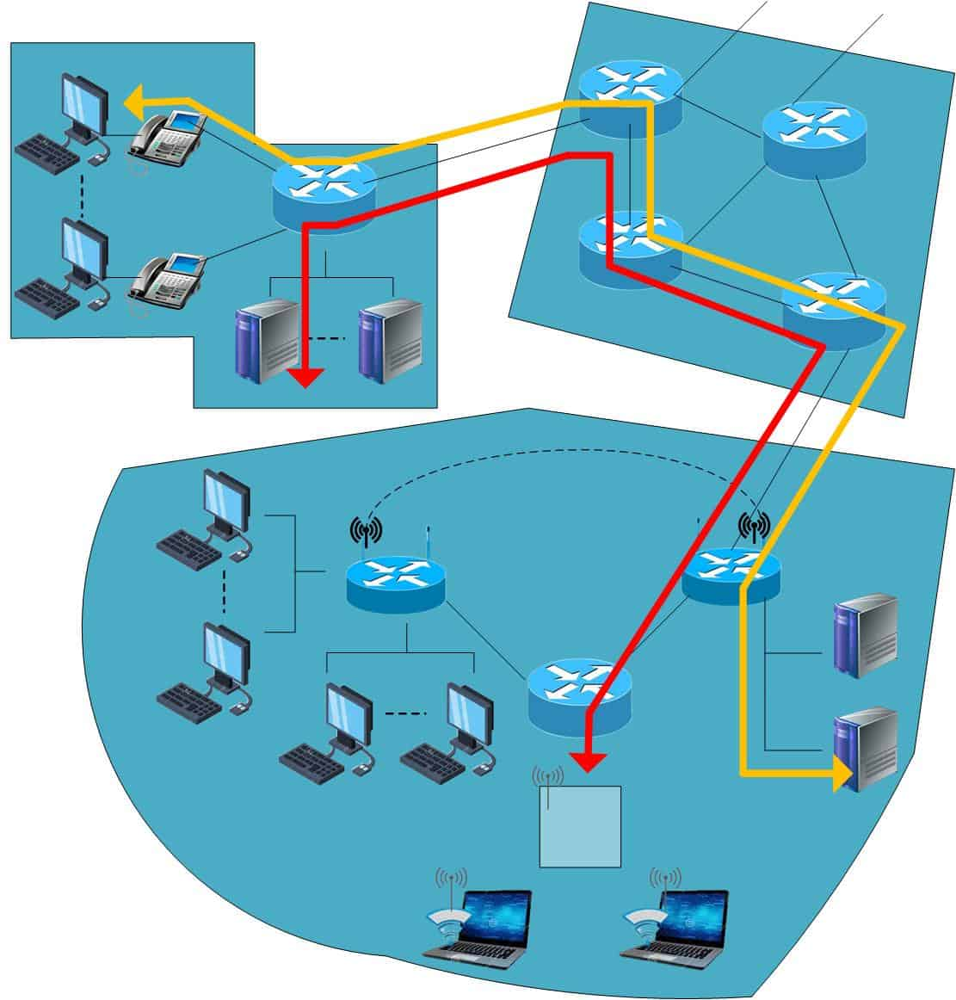
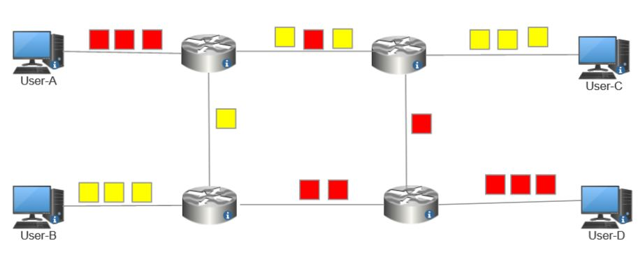
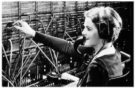
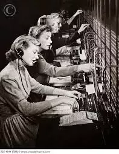
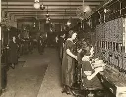
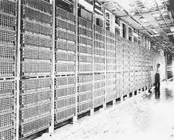
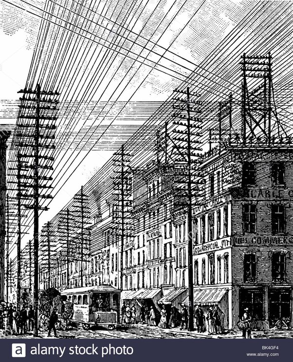

# Circuit Switching vs. Packet Switching
Computer and communication networks typically have more than one path from source to destination.

Switching refers to choosing the route the data will go through. Circuit and packet switching are the leading technologies we use in switched networks.

In this tutorial, we’ll discuss the differences between circuit and packet switching. We’ll start with the fundamentals of switching and then focus on the differences between the two techniques.

## Circuit Switching
In circuit switching, the communication mechanism establishes a path between the source and destination.

Intermediate switches set aside enough resources to serve each dedicated path going through them. Physical links connect the intermediate switches once the circuit has been established.

The data transfer from source to destination takes place over a dedicated path. The circuit terminates the connection once the data transfer has been successfully completed.

Although it was initially designed to handle voice traffic, circuit switching is now widely used for data traffic. The public telephone network is the most well-known example of a circuit-switching network.

The following diagram illustrates how a circuit-switched network operates:

The red and yellow lines represent two dedicated paths.

### Advantages of Circuit Switching
Circuit switching dedicates paths. So, there is no need to wait at each switch to decide where to send data. Therefore, transfers happen immediately.

Also, the data we send always reach their destination in order.

### Disadvantages of Circuit Switching
Circuit switching can be inefficient because it reserves system resources but doesn’t use them completely. The communication channel may be idle during most of the time the connection is live. For instance, utilization is high for voice connections but still doesn’t approach 100%.

There’s a delay prior to signal transfer for circuit establishment. Establishing the connection from the source to the destination can take too long.

Circuit switching requires more bandwidth and is more expensive.

## Packet Switching
In packet switching, users divide their data into smaller packets before sending them. Each packet has a packet header that contains the following: the packet type, source address, destination address, and sequence number of the packet within the message. The Internet is an example of a packet-switched network.

In this type of network, nodes need to exchange information between terminals and hosts. The overall function of such packet-switching is the transparent exchange of data in small packets between terminals and hosts. The terminals and hosts don’t route the packets. Instead, they merely specify the destination.

Packets carry the destination address, allowing them to be individually routed through the network. In adaptive routing, they follow the route that will minimize the delay. As each packet contains the destination address, the packets from the same message can travel by completely different routes and still reach the same destination address. For example:

In the above figure, user-A sends the red packets to user-D, and user-B sends the yellow packets to user-C. We see that packets from the same user and message can follow different paths. The intermediate nodes (routers) forward the packets until they reach the destination.

### Advantages of Packet Switching
Packet switching is cost-effective and easier to implement.

In packet-switching networks, users communicate with each other indirectly. This means there is no end-to-end communication. Thus, this switching type uses less bandwidth as packets quickly route toward the destination.

Packet switching doesn’t take up a large amount of space. In the case of a packet loss, we can request a copy to complete the message.

### Disadvantages of Packet Switching
Packet switching is unsuitable for applications that can’t afford delays in communication. That is the case with voice calls.

There’s a higher installation cost.

## Differences Between Packet and Circuit Switching
Now, let’s quickly summarize the main differences between circuit and packet switching:

| Circuit Switching |	Packet Switching |
| ---- | ----- |
| Connection-oriented |	Connectionless |
| Dedicated transmission path	| No dedicated path |
| Continuous transmission | Transmission of packet |
| Same path for duration of connection |Each packet may take different route |
| No storage of data | Store-and forward packets |
| Overload may block call	| Overload increases packet delay |
| Fixed bandwidth transmission | Dynamic use of bandwidth |
| Can use any bit format or framing	| Packets have special formats |

## Conclusion
In this article, we talked about the circuit and packet switching techniques. We also presented the main differences between them.

In packet-switching networks, users communicate with each other indirectly. They divide message into packets and send them individually over the network. In contrast, users communicate directly in circuit-switched networks over dedicated paths reserved solely for their and no one else’s communication.

## Source
https://www.baeldung.com/cs/circuit-switching-vs-packet-switching

# Why is packet switching used for the Internet?
It basically comes down to the size of the network, meaning the number of nodes.

The precursor to packet switching networks are circuit switching networks, as used by the telephone and telegraph industries.

Circuit switching networks operate under the premise that each endpoint will have at its disposal a complete and dedicated connection pathway to every other endpoint on the network.

This was fine when the telephone was a novelty, and led to quant situations as:

which led to:

and which led to:

and ultimately to this:

which saved on labor costs. Now about those dedicated pathways… That’s a lot of wire.

Here’s Manhattan, circa 1890.

and Philadelphia duringthe same period. You can find any number of photos with similar vistas. Here’s a good start:

Now, this was over 125 years ago, when the phone was a novelty for most. Granted, some scaling was accomplished but the technology is still the same as it was back then.

Packet switching allows dynamic routing, and the reassembly of data streams in the right order, as well as prioritization, and other useful things.

If 30% of the homes in your neighborhood all decided to pick up the phone at the same time, chances are some of them wouldn’t get dial tone. They simply can’t all connect over the installed trunks. Computers don’t tolerate that too well.

IBM SNA was pretty much the way people thought the computer networking revolution was going to go back in the 70s, but packet switching just became much more efficient to implement, and being based on open standards, faster to improve upon.

## Source
https://www.quora.com/Why-is-packet-switching-used-for-the-Internet
