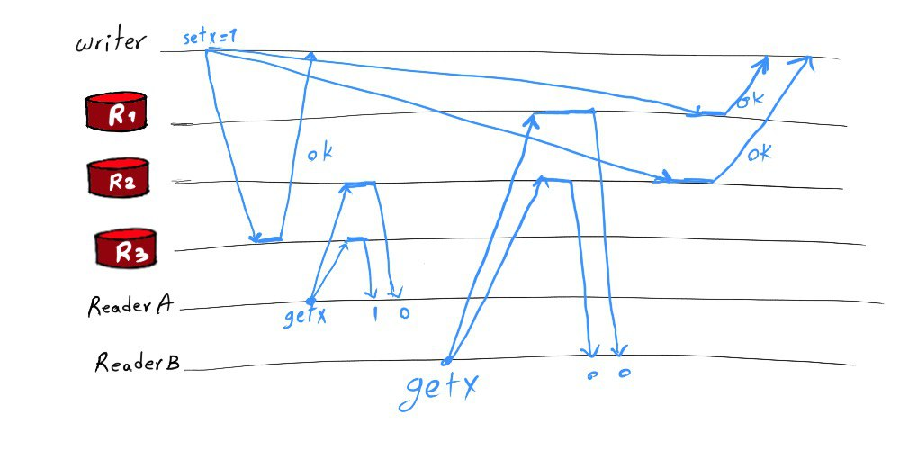

# DynamoDB, Ten Years Later
## Multi-Paxos instead of Leaderless Replication
Unlike the original Dynamo which uses a leaderless replication approach, DynamoDB uses a leader-based approach.

### Replication in the Original Dynamo
Dynamo uses a leaderless quorum-based consistency approach. To write a value, the client sends its request to the coordinator node of the key. The coordinator applies the write locally and forwards the write request to the other N-1 replicas. It will then waits for W-1 of them to acknowledge the write before returning to the client. Similarly, to read, the coordinator sends the request to all N-1 replicas and waits for R-1 responses from them. Then, it returns the newest version out of R-1 responses heard from other replicas and its own version. When we use leaderless replication, we may have conflicts. To determine the newest version or detect conflicts, Dynamo uses vector clocks. I have talked about conflict resolution using vector clocks previously in this blog. In case of a conflict, Dynamo returns conflicting versions, letting the application decide to use which version.

R and W are configurable parameters. To make sure our read operations don't read stale data, we can set R and W such that R + W > N. We usually pick an odd number for N and use R = W= (N+1)/2 . Note that although setting R and W such that R + W > N hopefully results in reading the most recent version, that is NOT guaranteed, i.e., there are corner cases where we read stale. That can happen due to sloppy quorums (to tolerate replica failures), conflict resolution, or failure of write on some replicas while succeeding on other replicas.

Even when none of these cases happens, we may have situations where linearizability (the strong consistency in the CAP theorem [3]) is not guaranteed, because reading the most recent version is NOT enough for linearizability. Linearizability requires the datastore to respect the real-time order of operations, i.e., if operation B starts after operation A returned to the client, we should never see the state of the datastore as if A is executed before B. With this definition, linearizability may be still violated even when we guarantee readers always find the most recent version written by a write request that is returned to the client. An example (shown in Figure 1) for this case is provided in [4]. In this example, Reader B reads the value of x after the read operation of reader A is returned to the client. However, as shown in the figure, even with R+W>N (e.g. N=3, R=W=2), reader B may read the old value of x, while A reads the new value, i.e., it seems A is executed after B, and that is not acceptable under linearizability.

Figure 1. An example of how linearizability may be violated even when read and write quorums are intersecting [4]. We have N=3, R=W=2. Reader B starts after reader A's request is returned, but the system appears as if reader B started before A; reader A reads the new value 1, while reader B reads the old value 0.

### Replication in DynamoDB
To prevent problems of leaderless replication and provide strong consistency, DynamoDB uses a leader-based replication approach. Replicas of each partition form a replication group. DynamoDB uses Multi-Paxos for leader election (learn more from this blog: Paxos, Raft). To write a value, the client sends its request to the leader replica. The leader replica returns to the client after receiving acknowledgment from a quorum of replicas. To read, the client may access the leader or any of the followers depending on the level of consistency that it wants. For strong consistency, the client must read from the leader, as reading from followers may result in reading stale data. With this replication, linearizability is guaranteed and we don't need to deal with conflicts.

It seems we deal with quorums with Multi-Paxos as well, then how it is different from the quorum approach?
Yea, the idea of waiting for a quorum before returning to the client is shared in both approaches. However, there is a fundamental difference and that is the leaderless vs. leader-based natures of these methods. Scenarios like the one shown in Figure 1 never happen when using leader election; both readers A and B have to refer to the leader to read x, and this leader linearizes the operations. The original Leslie Lamport's Paxos uses majorities for two phases of Paxos (see this). However, majorities are not necessary, and similar to the R + W > N idea, only intersecting quorums are enough for Paxos to work.

#### Better Failure Detection
To avoid split brain during leader changes, DynamoDB uses leases. Specifically, a newly elected leader does not accept writes until the lease of the previous leaders is ended. That can be a few seconds. That means false leader failure detections are costly and must be avoided. Sometimes the leader is healthy and can communicate perfectly with a quorum of replicas. However, a single replica cannot verify the health of the leader. This situation is called a gray network failure in [1]. To prevent the affected replica from disrupting the system by starting a new leader election, DynamoDB uses the following approach: The affected replica first talks to other replicas to see what they think about the leader. Only if they also confirm that leader is dead, it starts the leader election. With this simple change, DynamoDB significantly minimized false leader failure detections.

In cases where the existing leader is intentionally going to be unavailable, e.g., for a deployment, it steps down as the leader by letting the other know, before deployment starts. This way, the new leader does not need to wait out the lease period, so interruption will be shorter.

## Source
https://www.mydistributed.systems/2022/10/dynamodb-ten-years-later.html
